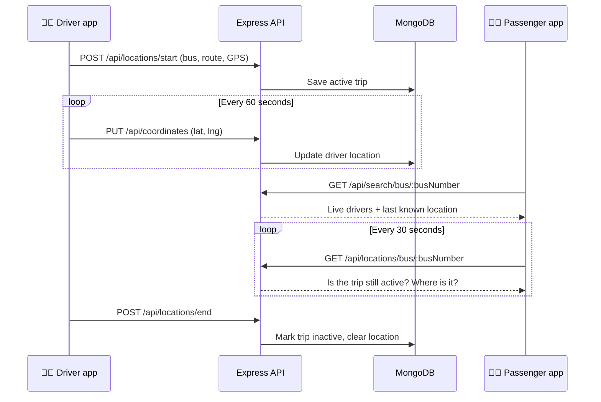

<div align="center">

# 🚌 SmartBus Tracker

**Know exactly where your college bus is — in real time.**

Find buses by number or by the stops you travel between, follow live driver locations,<br/>
and share feedback with other passengers.

[](https://angular.dev)
[](https://nodejs.org)
[](https://expressjs.com)
[](https://www.mongodb.com)
[](https://tailwindcss.com)

[**Live demo**](#-deployment) · [Features](#-features) · [Quick start](#-quick-start) · [API](#-api-reference) · [Deploy](#-deployment)

<!-- Replace with a real screenshot: docs/screenshot-landing.png -->


</div>

---

## 📖 Table of contents

- [About](#-about)
- [Features](#-features)
- [Screenshots](#-screenshots)
- [How it works](#-how-it-works)
- [Tech stack](#-tech-stack)
- [Quick start](#-quick-start)
- [Configuration](#-configuration)
- [Available scripts](#-available-scripts)
- [Project structure](#-project-structure)
- [API reference](#-api-reference)
- [Deployment](#-deployment)
- [Troubleshooting](#-troubleshooting)
- [Roadmap](#-roadmap)
- [Contributing](#-contributing)

---

## 💡 About

Waiting at a bus stop without knowing whether the bus has already left is frustrating. **SmartBus Tracker** solves this for college commuters: drivers share their live GPS location while on a trip, and passengers can look up any bus and follow it as it approaches.

The app has two kinds of users:

| Role | What they can do |
|------|------------------|
| 🧑‍🎓 **Passenger** | Search buses by number or route, track live buses, read and write reviews |
| 🧑‍✈️ **Driver** | Everything a passenger can do, plus **start / end trips** that broadcast their location |

> Started as a first-year college project and later refreshed with a modern UI, security fixes and deployment setup.

## ✨ Features

**For passengers**
- 🔢 **Find by number** — enter a bus number and see every driver currently running it, with last-updated time and location.
- 🛣️ **Find by route** — pick a *from* and *to* stop (with autocomplete) and get every bus that connects them, plus their live drivers.
- 📍 **Live tracking list** — save buses to your personal tracking list; positions refresh automatically every 30 seconds and ended trips are clearly marked.
- 🗺️ **All routes at a glance** — browse every bus route with its full stop timeline, and filter by bus number or stop name.
- ⭐ **Reviews** — rate buses 1–5 stars, leave a comment, and see the average rating.

**For drivers**
- ▶️ **Start a trip** with a bus number and route; your location is sent every 60 seconds with a visible countdown.
- ⏹️ **End a trip** to stop sharing and remove your stored location data.
- 🔄 Trip state survives page refreshes, and stale trips are automatically closed.

**Under the hood**
- 🔐 JWT authentication with hashed passwords (bcrypt) and role-based route guards
- 📱 Fully responsive — mobile, tablet and desktop
- ♿ Accessible — semantic HTML, labelled forms, keyboard-friendly dialogs, skip link, reduced-motion support
- 🛡️ Server-side input validation, secrets via environment variables, JSON error responses

## 📸 Screenshots

<!-- Add images to a docs/ folder and they'll show up here. -->

| Landing | Dashboard |
|:---:|:---:|
|  |  |
| **Find by route** | **Driver trip** |
|  |  |

## ⚙️ How it works



Route data (stops for buses **279**, **280**, **290U** and **300**) lives in [`bus-routes.service.ts`](app_public/src/app/services/bus-routes.service.ts), so route search works instantly in the browser; only live driver data comes from the API.

## 🧰 Tech stack

| Layer | Technology |
|-------|------------|
| **Frontend** | Angular 20 (standalone components), TypeScript, Tailwind CSS v4 |
| **Backend** | Node.js, Express 4 |
| **Database** | MongoDB with Mongoose 8 |
| **Auth** | JSON Web Tokens (`jsonwebtoken`), `bcryptjs` |
| **Hosting** | Render (single service) + MongoDB Atlas |

## 🚀 Quick start

### Prerequisites

- [Node.js](https://nodejs.org) **20.12 or newer**
- [MongoDB](https://www.mongodb.com/try/download/community) running locally, **or** a free [MongoDB Atlas](https://www.mongodb.com/atlas) cluster

### 1. Clone and install

```bash
git clone https://github.com/shiva-1301/Bus_tracking_app.git
cd Bus_tracking_app

npm install                       # backend
npm --prefix app_public install   # frontend
```

### 2. Configure environment

```bash
cp .env.example .env
```

Open `.env` and set at least `MONGODB_URI` and `JWT_SECRET` (see [Configuration](#-configuration)).

### 3. Run in development

Use two terminals:

```bash
npm run dev:api   # API      → http://localhost:3000
npm run dev:web   # Frontend → http://localhost:4200
```

Open **http://localhost:4200**, create an account, and you're in. To try driver mode, register a second account with **Driver** selected and a driver ID.

### 4. Run like production (optional)

```bash
npm run build   # builds the Angular app
npm start       # serves API + frontend on http://localhost:3000
```

## 🔧 Configuration

All backend settings come from environment variables (or a local `.env` file).

| Variable | Required | Default | Description |
|----------|:--------:|---------|-------------|
| `MONGODB_URI` | ✅ | `mongodb://localhost:27017/RouteFinderDB` | MongoDB connection string |
| `JWT_SECRET` | ✅ in production | insecure dev value | Long random string used to sign login tokens |
| `JWT_EXPIRES_IN` | | `7d` | How long a login lasts |
| `CORS_ORIGIN` | | `*` | Frontend URL allowed to call the API |
| `PORT` | | `3000` | Server port |

Generate a strong secret with:

```bash
node -e "console.log(require('crypto').randomBytes(48).toString('hex'))"
```

<details>
<summary><b>🗺️ Optional: Google Maps thumbnails</b></summary>

<br/>

Bus cards can show a small map image. Add a **Maps Static API** key to
`app_public/src/environments/environment.ts` (production) and `environment.development.ts` (local):

```ts
googleMapsApiKey: 'YOUR_KEY_HERE',
```

Browser keys are always visible to users, so **restrict the key to your domain** (HTTP referrer restriction) in Google Cloud Console. Without a key, cards show a placeholder and an "Open in Google Maps" link instead.

</details>

## 📜 Available scripts

Run from the project root:

| Command | What it does |
|---------|--------------|
| `npm run dev:api` | Start the Express API on port 3000 |
| `npm run dev:web` | Start the Angular dev server on port 4200 |
| `npm run build` | Install frontend deps and build the Angular app for production |
| `npm start` | Serve the API and the built frontend together |

## 🗂️ Project structure

```
Bus_tracking_app/
├── app.js                    # Express app: API routes + serves the Angular build
├── bin/www                   # Server entry point
├── app_server/               # Backend
│   ├── config.js             #   environment-based configuration
│   ├── controllers/          #   users, locations, coordinates, reviews
│   ├── middleware/auth.js    #   JWT verification
│   ├── models/               #   Mongoose schemas
│   ├── routes/               #   /api/* routers
│   └── utils/validation.js   #   input validation helpers
├── app_public/               # Frontend (Angular)
│   └── src/
│       ├── app/              #   pages, services, shared helpers
│       ├── environments/     #   API URL + Maps key per environment
│       └── styles.css        #   design tokens + shared UI classes
├── scripts/dev/              # One-off database debugging scripts
├── .env.example              # Template for your local .env
└── render.yaml               # One-click Render deployment
```

## 🔌 API reference

Base URL: `/api` · Protected routes need an `Authorization: Bearer <token>` header (the token comes from login/register).

<details>
<summary><b>Auth</b></summary>

| Method | Endpoint | Auth | Description |
|--------|----------|:----:|-------------|
| `POST` | `/register` | – | Create an account. Body: `email`, `password`, `role` (`user` \| `driver`), `driverId` (drivers only) |
| `POST` | `/login` | – | Log in. Body: `email`, `password`. Returns `token`, `role`, `userId`, `driverId`, `email` |

</details>

<details>
<summary><b>Search & tracking</b></summary>

| Method | Endpoint | Auth | Description |
|--------|----------|:----:|-------------|
| `GET` | `/search/bus/:busNumber` | – | Drivers registered on a bus, with last known location |
| `GET` | `/locations` | – | All active trips |
| `GET` | `/locations/bus/:busNumber` | – | Active trips for one bus |
| `GET` | `/coordinates` | – | Latest coordinate for every driver |
| `GET` | `/coordinates/bus/:busNumber` | – | Latest coordinates for a bus's drivers |
| `GET` | `/coordinates/driver/:driverId` | – | Latest coordinate for one driver |

</details>

<details>
<summary><b>Driver trips</b></summary>

| Method | Endpoint | Auth | Description |
|--------|----------|:----:|-------------|
| `POST` | `/locations/start` | 🔒 driver | Start a trip. Body: `busNumber`, `driverId`, `startLocation`, `endLocation`, `latitude`, `longitude` |
| `PUT` | `/locations/update` | 🔒 driver | Update the active trip's position |
| `POST` | `/locations/end` | 🔒 driver | End the active trip |
| `GET` | `/locations/check` | 🔒 | Does the current user have an active trip? |
| `PUT` | `/coordinates` | 🔒 driver | Push the latest GPS coordinate |
| `POST` | `/coordinates/delete` | 🔒 driver | Delete the driver's stored coordinates |
| `PUT` | `/driver/location` | 🔒 driver | Update the driver's current location. Body: `lat`, `lng` |

</details>

<details>
<summary><b>Reviews</b></summary>

| Method | Endpoint | Auth | Description |
|--------|----------|:----:|-------------|
| `GET` | `/reviews` | – | All reviews, newest first |
| `GET` | `/reviews/bus/:busNumber` | – | Reviews for one bus |
| `POST` | `/reviews` | – | Add a review. Body: `username`, `rating` (1–5), `comment` (≤ 500 chars), `busNumber` (optional) |

</details>

Errors are returned as JSON, e.g. `{ "error": "Access denied. No token provided." }`.

## ☁️ Deployment

The simplest free setup is **Render** (runs the API and serves the website as one service) with **MongoDB Atlas** for the database. A ready-made [`render.yaml`](render.yaml) is included.

1. **Database** — create a free MongoDB Atlas cluster, add a database user, allow network access from `0.0.0.0/0`, and copy the connection string.
2. **Push** this repo to GitHub.
3. **Create the service** — on [render.com](https://render.com) choose **New → Blueprint** and select this repository.
4. **Set secrets** when prompted:
   - `MONGODB_URI` → your Atlas connection string
   - `CORS_ORIGIN` → your Render URL, e.g. `https://smartbus-tracker.onrender.com`
   - `JWT_SECRET` is generated automatically
5. **Deploy**, then replace the "Live demo" link at the top of this README with your URL.

> ℹ️ Free Render services sleep after inactivity, so the first request can take ~30 seconds.

## 🩺 Troubleshooting

| Problem | Fix |
|---------|-----|
| "Can't reach the server" on login | Make sure `npm run dev:api` is running and MongoDB is reachable |
| `Mongoose connection error` | Check `MONGODB_URI`; for Atlas, confirm your IP is allowed |
| `JWT_SECRET environment variable is required` | Set `JWT_SECRET` — it's mandatory when `NODE_ENV=production` |
| `npm install` fails with peer-dependency errors in `app_public` | The included `app_public/.npmrc` handles this — make sure it's present |
| Driver trip won't start | Allow location access in the browser; geolocation also requires `https` (or `localhost`) |
| Logged out unexpectedly | Your token expired (default 7 days) — just log in again |

## 🗺️ Roadmap

- [ ] Live map view with moving bus markers
- [ ] Estimated arrival time at each stop
- [ ] Manage bus routes from the database instead of a frontend file
- [ ] Admin approval for driver accounts
- [ ] Push notifications when a tracked bus is near your stop
- [ ] WebSocket updates instead of polling

## 🤝 Contributing

Suggestions and pull requests are welcome!

1. Fork the repo and create a branch: `git checkout -b feature/my-idea`
2. Commit your changes: `git commit -m "Add my idea"`
3. Push and open a pull request

Found a bug? [Open an issue](https://github.com/shiva-1301/Bus_tracking_app/issues).

---

<div align="center">

Built with ☕ by <a href="https://github.com/shiva-1301">shiva-1301</a> · If this project helped you, consider giving it a ⭐

</div>
